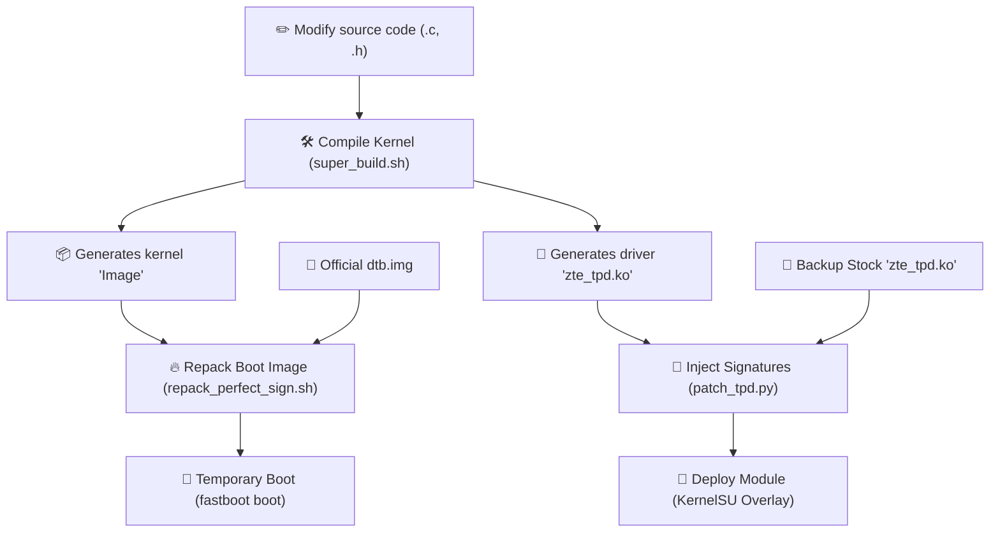

# 🛠️ Complete Compilation, Signing, and Booting Guide - Red Magic 11 Pro (NX809J)

This document is prepared for new developers and details the step-by-step pipeline for compiling the custom kernel (GKI Kernel 6.12 / Android 16), patching the mandatory signatures and KCFI hashes in modular drivers, and generating a fully functional boot image ready for the device.

---

## 📌 Workflow Overview

In order for driver modifications (such as the touchscreen driver `zte_tpd.ko`) and custom kernel patches to boot correctly without causing a bootloop or touchscreen failure, you must follow the pipeline below:



---

## 💻 1. Compilation Environment Requirements

To compile the kernel, you need a compatible Clang compiler toolchain and the official Android platform build tools.

### Expected Directory Structure:
* **Clang Compiler:** Must be placed at the root of the repository, inside a directory named `clang-r536225`.
* **Additional Downloads:** 
  - [Android Clang r536225](https://android.googlesource.com/platform/prebuilts/clang/host/linux-x86/+/refs/heads/main-order/clang-r536225/)
  - The packaging scripts (`mkbootimg_v4.py` and `avbtool`) are already included in this repository.

---

## ⚙️ 2. Step-by-Step Compilation

### Step A: Force Clean Version Timestamp (Optional)
If you want the compiled kernel to display the exact current time of compilation and increment the official build number (`#XX`), clean the version build cache by running:
```bash
rm -f kernel_platform/common/init/version.o \
      kernel_platform/common/init/version-timestamp.o \
      kernel_platform/common/include/generated/compile.h
```

### Step B: Run the Kernel Compilation
All parameters have been centralized in the `super_build.sh` automation script located at the root of the repository. To start the build of all kernel components (including built-in and modular drivers), execute:
```bash
./super_build.sh
```

> [!NOTE]
> **What does `super_build.sh` do under the hood and why does it inject configs?**
> ZTE does not provide or expose a complete configuration file containing advanced debug options, CFI settings, and custom modules (like KernelSU) in their base `defconfig`. Trying to modify the `.config` file manually is fragile because it gets overwritten during clean cycles.
> 
> To bypass this, `super_build.sh` performs a dynamic injection:
> 1. It exports key build environment variables (`ARCH=arm64`, `CROSS_COMPILE`, etc.) pointing to the local Clang.
> 2. It applies the official base configuration (`nx809j_defconfig`).
> 3. **Config Injection:** It appends critical overrides directly to the generated `.config` (enabling **KernelSU-Next** via `CONFIG_KSU=y`, enabling `CONFIG_CFI_CLANG=y` for security, forcing extended modversions, and enabling BTF debugging).
> 4. It executes `make olddefconfig` to resolve dependencies cleanly.
> 5. Finally, it compiles everything in parallel: `make -j$(nproc) LLVM=1 LLVM_IAS=1 Image modules dtbs`.

* Once the build completes, the compiled kernel image is located at:
  `kernel_platform/common/arch/arm64/boot/Image`
* The modular touch driver binary will be generated at:
  `kernel_platform/common/drivers/soc/qcom/zte/zte_tpd/zte_tpd.ko`

---

## 🔑 3. Why and How to Patch Modular Drivers?

> [!IMPORTANT]
> **UNDERSTANDING GKI SECURITY (Kernel Control Flow Integrity - KCFI)**
> The official ZTE stock kernel runs a very strict implementation of CFI (Control Flow Integrity) and CRC checks. If you compile a custom driver and attempt to load it directly, the GKI kernel on the phone will immediately reject it with an `Exec format error` or trigger a Kernel Panic.
> 
> **THE SOLUTION:** We developed a Python script called `patch_tpd.py` which reads the official stock backup driver (`stock_rom_modules/modules/zte_tpd.ko`) and surgically copies all valid signatures, CRCs, and KCFI hashes directly into your newly compiled modular driver. **This step is mandatory and must not be skipped!**

### How to Run the Signature Patch Script:
Run the script passing the official stock backup driver as the first argument, and your custom compiled driver as the second:
```bash
python3 kernel_platform/common/drivers/soc/qcom/zte/zte_tpd/patch_tpd.py \
    stock_rom_modules/modules/zte_tpd.ko \
    kernel_platform/common/drivers/soc/qcom/zte/zte_tpd/zte_tpd.ko
```
You will see output indicating the successful injection of hashes and CRCs for each symbol:
```text
Patching KCFI hash for 'syna_tcm_v1_detect': 0x3cc04631 -> 0x24cba334
Patching KCFI hash for 'syna_tcm_parse_fw_image': 0x8d4d6b82 -> 0xcf1edfe9
...
Done!
```

---

## 📦 4. Packaging and Signing the Boot Image

The Red Magic 11 Pro bootloader requires a specific, aligned boot partition size and a valid AVB digital signature footer to boot successfully, even during temporary RAM fastboot.

> [!WARNING]
> The physical boot partition of the Red Magic 11 Pro is exactly **96 Megabytes** (`100663296` bytes). Attempting to boot or flash a generic GKI boot image (typically 64MB) will trigger an AVB verification error ("Red State") and the phone will fall back to the stock partition.

### How to Repack and Sign:
Run the repack automation script from the root:
```bash
./repack_perfect_sign.sh
```

**What does this script do?**
1. Concatenates the compiled `Image` with the official screen device tree blob (`dtb.img`).
2. Creates the boot image structure using `mkbootimg_v4.py`.
3. Runs `avbtool` with the exact signature specifications required by the ZTE bootloader:
   ```bash
   python3 avbtool add_hash_footer \
       --image dev_reverse_perfect.img \
       --partition_name boot \
       --partition_size 100663296 \
       --algorithm NONE
   ```

* The signed boot image ready for testing is output to the root as `dev_reverse_perfect.img`.

---

## 📱 5. Deployment and Testing on the Device

Deployment consists of two main steps: updating the patched driver in the system and booting the custom kernel.

### Step 1: Deploy the Patched Module (via KernelSU Overlay)
Copy the newly patcheado `zte_tpd.ko` modular driver into the active KernelSU modules overlay path on your phone. This allows KernelSU to dynamically replace the stock driver during the early boot stages:
```bash
# 1. Push the patched modular driver to a secure temporary path
adb push kernel_platform/common/drivers/soc/qcom/zte/zte_tpd/zte_tpd.ko /data/local/tmp/zte_tpd.ko

# 2. Copy the module to the KernelSU modules overlay folder using root (su)
adb shell su -c "cp /data/local/tmp/zte_tpd.ko /data/adb/modules/zte_tpd_patch/system/vendor_dlkm/lib/modules/zte_tpd.ko"

# 3. Clean up the temporary push file
adb shell rm -f /data/local/tmp/zte_tpd.ko
```

### Step 2: Temporary Boot via Fastboot (Safe Method)
To test the custom kernel without modifying the physical flash memory of your phone, boot the system temporarily to RAM via fastboot:

1. Reboot the phone into bootloader mode:
   ```bash
   adb reboot bootloader
   ```
2. Once the device is on the fastboot screen, boot the image:
   ```bash
   fastboot boot dev_reverse_perfect.img
   ```
3. The phone will boot using your custom kernel `#XX` and automatically load the patched touchscreen driver overlay you installed in Step 1.

---

## 🔍 6. Basic Diagnostics and Verification

Once the system boots up, connect your phone and run these commands to confirm that everything is loaded and functioning correctly:

### A. Verify the active kernel version and build date:
```bash
adb shell cat /proc/version
```
*Should return your build username, the incremented build number, and the correct current date.*

### B. Confirm the touch module is loaded in memory:
```bash
adb shell su -c "lsmod | grep zte_tpd"
```
*Should list the `zte_tpd` driver active with its memory footprint.*

### C. Monitor live touch events and coordinates:
```bash
adb shell su -c "dmesg | grep -E -i 'tpd|syna|touch'"
```
*You should see active register logs, device handshakes, and coordinates (`touch_down`, `touch_up`) appearing as you touch the screen.*
