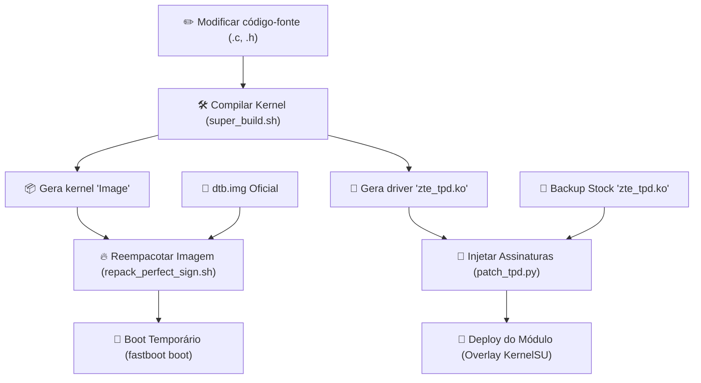

# 🛠️ Guia Completo de Compilação, Assinatura e Boot - Red Magic 11 Pro (NX809J)

Este documento foi preparado para novos desenvolvedores e descreve o pipeline de ponta a ponta para compilar o kernel customizado (GKI Kernel 6.12 / Android 16), realizar o patching obrigatório de assinaturas e KCFI nos drivers modulares, e gerar a imagem de boot funcional pronta para o aparelho.

---

## 📌 Visão Geral do Fluxo de Trabalho

Para que as modificações de drivers (como o touchscreen `zte_tpd.ko`) e as correções do kernel funcionem sem causar bootloop ou travar a tela, você deve seguir o seguinte pipeline:



---

## 💻 1. Requisitos do Ambiente de Compilação

Para compilar o kernel, você precisa de um compilador de Clang compatível e das ferramentas de build oficiais do Android.

### Estrutura de Diretórios Esperada:
* **Clang Compiler:** Deve estar localizado na raiz do repositório, em uma pasta chamada `clang-r536225`.
* **Downloads Adicionais:** 
  - [Android Clang r536225](https://android.googlesource.com/platform/prebuilts/clang/host/linux-x86/+/refs/heads/main-order/clang-r536225/)
  - O script de empacotamento (`mkbootimg_v4.py` e `avbtool`) já está incluído no repositório.

---

## ⚙️ 2. Compilação Passo a Passo

### Passo A: Forçar Atualização de Data e Hora (Opcional)
Se você deseja que o kernel seja gerado com a data/hora reais do momento exato de agora e que o número da versão (`#XX`) seja incrementado, exclua o cache do compilador executando:
```bash
rm -f kernel_platform/common/init/version.o \
      kernel_platform/common/init/version-timestamp.o \
      kernel_platform/common/include/generated/compile.h
```

### Passo B: Rodar a Compilação do Kernel
Tudo foi centralizado no script de automação `super_build.sh` localizado na raiz do projeto. Para iniciar a compilação de todos os componentes do kernel (incluindo drivers embutidos e modulares), execute:
```bash
./super_build.sh
```

> [!NOTE]
> **O que o `super_build.sh` faz nos bastidores e por que injetamos configurações?**
> A ZTE não fornece ou expõe um arquivo de configuração completo com opções avançadas de debug, suporte a CFI e módulos customizados (como o KernelSU) no seu `defconfig` de base. Modificar manualmente o arquivo `.config` gerado é frágil, pois ele é apagado a cada ciclo de limpeza (`make clean`).
> 
> Para contornar essa ocultação, o script `super_build.sh` realiza uma injeção dinâmica genial:
> 1. Configura as variáveis de ambiente necessárias (`ARCH=arm64`, `CROSS_COMPILE`, etc.) e define o compilador Clang local.
> 2. Aplica as configurações oficiais de base do ZTE (`nx809j_defconfig`).
> 3. **Injeção de Configurações:** Anexa diretamente as chaves e overrides cruciais ao arquivo `.config` gerado (ativando o **KernelSU-Next** via `CONFIG_KSU=y`, ativando integridade `CONFIG_CFI_CLANG=y`, forçando extended modversions e ativando depuração via BTF).
> 4. Executa `make olddefconfig` para resolver todas as dependências de forma limpa e segura.
> 5. Por fim, executa a compilação paralela: `make -j$(nproc) LLVM=1 LLVM_IAS=1 Image modules dtbs`.

* Ao final da compilação, o kernel principal compilado estará gerado em:
  `kernel_platform/common/arch/arm64/boot/Image`
* O módulo do driver de toque compilado estará em:
  `kernel_platform/common/drivers/soc/qcom/zte/zte_tpd/zte_tpd.ko`

---

## 🔑 3. Por Que e Como Patchear Drivers Modulares?

> [!IMPORTANT]
> **ENTENDENDO A SEGURANÇA DO GKI (Kernel Control Flow Integrity - KCFI)**
> O kernel oficial da ZTE possui verificações de integridade estritas baseadas em CFI (Control Flow Integrity) e CRCs. Se você compilar um driver customizado e tentar carregá-lo diretamente, o kernel do telefone o rejeitará imediatamente com erros do tipo `Exec format error` ou causará Kernel Panic.
> 
> **A SOLUÇÃO:** Desenvolvemos um script em Python chamado `patch_tpd.py` que lê o driver stock oficial (original da ZTE) e injeta cirurgicamente todas as assinaturas e hashes KCFI válidos diretamente no seu driver recém-compilado. **Esta etapa é obrigatória e nunca deve ser ignorada!**

### Como rodar o Patch de Assinaturas:
Execute o script passando o caminho do driver stock oficial de backup e depois o caminho do driver modular compilado por você:
```bash
python3 kernel_platform/common/drivers/soc/qcom/zte/zte_tpd/patch_tpd.py \
    stock_rom_modules/modules/zte_tpd.ko \
    kernel_platform/common/drivers/soc/qcom/zte/zte_tpd/zte_tpd.ko
```
Você verá uma enxurrada de linhas mostrando a injeção e correção dos hashes e dos CRCs:
```text
Patching KCFI hash for 'syna_tcm_v1_detect': 0x3cc04631 -> 0x24cba334
Patching KCFI hash for 'syna_tcm_parse_fw_image': 0x8d4d6b82 -> 0xcf1edfe9
...
Done!
```

---

## 📦 4. Empacotando e Assinando a Boot Image

O bootloader do Red Magic 11 Pro exige um tamanho de partição de boot alinhado e assinado digitalmente por AVB para ser aceito, mesmo via fastboot RAM.

> [!WARNING]
> A partição física de boot do Red Magic 11 Pro é de exatamente **96 Megabytes** (`100663296` bytes). Tentar enviar imagens de tamanhos diferentes (como 64MB padrão do GKI) fará com que o telefone exiba uma tela vermelha ("Red State / AVB Verification Failed") e volte automaticamente para o kernel stock.

### Como rodar o Repack e Assinatura:
Execute o script automatizado da raiz:
```bash
./repack_perfect_sign.sh
```

**O que este script executa?**
1. Une o kernel compilado (`Image`) com a árvore de dispositivos oficiais de tela (`dtb.img`).
2. Gera a estrutura da imagem usando o `mkbootimg_v4.py`.
3. Executa a ferramenta `avbtool` com as configurações exatas exigidas pela ZTE:
   ```bash
   python3 avbtool add_hash_footer \
       --image dev_reverse_perfect.img \
       --partition_name boot \
       --partition_size 100663296 \
       --algorithm NONE
   ```

* O arquivo de saída final pronto para boot será gerado na raiz: `dev_reverse_perfect.img`.

---

## 📱 5. Implantação e Deploy no Aparelho

A implantação ocorre em duas etapas complementares: a atualização do driver modular no sistema e o boot temporário do kernel principal.

### Etapa 1: Deploy do Módulo Patcheado (via KernelSU)
Copie o driver modular recém-patcheado com as assinaturas oficiais para a pasta de overlay correspondente do KernelSU no celular. Isso fará com que o KernelSU substitua o driver oficial pelo seu customizado em tempo de inicialização:
```bash
# 1. Envia o driver patcheado para uma pasta temporária segura
adb push kernel_platform/common/drivers/soc/qcom/zte/zte_tpd/zte_tpd.ko /data/local/tmp/zte_tpd.ko

# 2. Copia para o local de overlay de vendor com permissões elevadas via su
adb shell su -c "cp /data/local/tmp/zte_tpd.ko /data/adb/modules/zte_tpd_patch/system/vendor_dlkm/lib/modules/zte_tpd.ko"

# 3. Limpa o arquivo temporário
adb shell rm -f /data/local/tmp/zte_tpd.ko
```

### Etapa 2: Boot Temporário (Fastboot)
Para testar o kernel principal sem risco de brickar o smartphone, utilize a inicialização temporária na memória RAM via fastboot:

1. Reinicie o celular em modo bootloader:
   ```bash
   adb reboot bootloader
   ```
2. Após o telefone entrar na tela do bootloader, execute o boot da imagem gerada:
   ```bash
   fastboot boot dev_reverse_perfect.img
   ```
3. O celular carregará o seu kernel customizado `#XX` com a data atual e lerá automaticamente o driver de toque customizado e patcheado que você instalou na Etapa 1.

---

## 🔍 6. Diagnóstico e Verificação Básica

Após o boot do smartphone, conecte-o via USB e execute estes comandos rápidos para ter certeza de que tudo foi inicializado corretamente:

### A. Verificar a versão e a data ativa do kernel:
```bash
adb shell cat /proc/version
```
*Deverá retornar o seu nome de build, o número incremental e a data de compilação recente.*

### B. Verificar se o driver de toque customizado está ativo:
```bash
adb shell su -c "lsmod | grep zte_tpd"
```
*Deverá exibir a listagem do driver ativo na memória.*

### C. Acompanhar os toques físicos e respostas tátis:
```bash
adb shell su -c "dmesg | grep -E -i 'tpd|syna|touch'"
```
*Você deverá ver as mensagens de toque detectadas fisicamente pelo painel (`touch_down`, `touch_up`) e a atividade SPI.*
