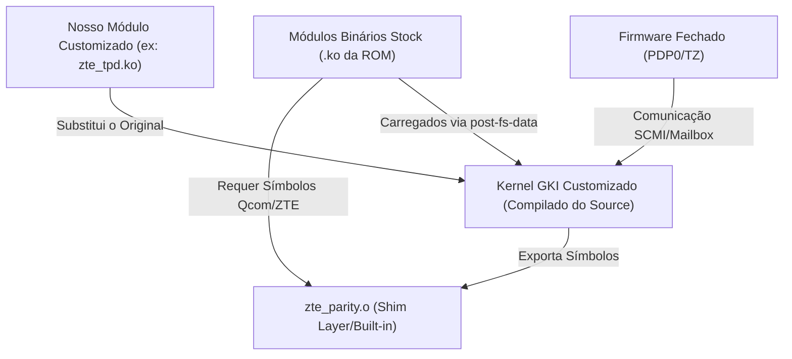

# Guia de Engenharia Reversa e Integração Híbrida (Caminho Parcial)

Este guia descreve a metodologia técnica para compilar um **Kernel GKI Customizado** funcional, contornando a ausência dos códigos-fontes proprietários da ZTE. A abordagem consiste em **carregar os módulos binários oficiais (`.ko`) da ROM de estoque** sobre o nosso kernel customizado, utilizando uma camada de compatibilidade de símbolos (*Symbol Shim Layer*) e desativando travas de segurança do Kernel Linux (como KCFI e assinaturas de módulo).

---

## 🛠️ Visão Geral da Arquitetura Híbrida

Como não temos o código-fonte da totalidade dos drivers, o kernel é compilado de forma híbrida:



---

## 📋 Fase 1: Mapeamento de Símbolos Faltantes (Triage)

Quando tentamos carregar um módulo binário oficial (`.ko`) em um kernel customizado, o carregador de módulos do Linux rejeita o carregamento se houver qualquer símbolo indefinido (*undefined symbol*).

### 1. Identificar Símbolos Requeridos pelo Módulo de Estoque
Para saber quais funções de kernel o módulo fechado da ZTE espera encontrar, execute:
```bash
# Lista todos os símbolos indefinidos (U) no driver proprietário
aarch64-linux-gnu-nm -u zte_tpd.ko
# Ou use readelf para detalhar a tabela de símbolos
aarch64-linux-gnu-readelf -s zte_tpd.ko | grep UND
```

### 2. Implementar a Ponte de Paridade em `zte_parity.c`
Para cada símbolo proprietário Qualcomm ou ZTE que o módulo fechado requeira, e que não esteja presente ou exportado no Kernel GKI padrão, criamos um stub ou redirecionamento em `drivers/soc/qcom/zte_parity.c`:

```c
// Exemplo: Se o módulo requerer a função 'get_ss_panic_buf_byte'
u8 get_ss_panic_buf_byte(void) {
    // Retorna um valor stub seguro ou implementa comportamento básico
    return 0; 
}
EXPORT_SYMBOL(get_ss_panic_buf_byte);
```

---

## 🔓 Fase 2: Desativação de Travas e Proteções de Segurança

O Kernel Linux GKI moderno possui travas estritas para evitar a injeção de módulos não homologados ou adulterados. Precisamos desativá-las nas configurações de compilação do kernel (`nx809j_defconfig`).

### 1. Contornar o KCFI (Kernel Control Flow Integrity)
O KCFI verifica se as assinaturas de tipo de função do módulo batem com o kernel. Módulos compilados com compiladores ou opções levemente diferentes falharão e causarão Kernel Panic.
*   **Ação:** Ative o modo permissivo do CFI para transformar pânicos em apenas alertas (*Warnings*):
    ```ini
    CONFIG_CFI_PERMISSIVE=y
    ```

### 2. Desativar Assinatura Obrigatória de Módulos
Módulos oficiais são assinados digitalmente pela chave privada da ZTE em tempo de compilação de fábrica. Nosso kernel customizado rejeitará módulos sem assinatura válida por padrão.
*   **Ação:** Desativar a checagem obrigatória no defconfig:
    ```ini
    # CONFIG_MODULE_SIG_FORCE is not set
    CONFIG_MODULE_SIG=y
    ```

### 3. Ignorar Erros de BTF (BPF Type Format)
Ao compilar módulos out-of-tree (como display ou câmera), o utilitário `pahole` valida as estruturas do kernel. Em compilações híbridas, structs modificadas podem quebrar o build.
*   **Ação:** Ignorar a geração de BTF especificamente para módulos problemáticos no script de vinculação final (`scripts/Makefile.modfinal`):
    ```makefile
    elif echo "$@" | grep -q "zte_tpd"; then \
        printf "Bypassing BTF generation specifically for zte_tpd.ko\n" $@; \
    ```

---

## 🔧 Fase 3: Resolução do SCMI/Mailbox (Nosso Bloqueador Atual)

O travamento no logotipo da RedMagic ocorre porque o firmware fechado da CPU (`PDP0`) perde a sincronia de tempo de resposta (*SCMI timeout*) com o nosso driver SCMI compilado.

### Passos para depurar e corrigir a mailbox de SCMI:

1.  **Extrair e Comparar a Árvore de Dispositivos (Device Tree - DTB):**
    Precisamos garantir que os endereços de memória física da mailbox e interrupções no nosso kernel correspondam exatamente aos do kernel de estoque:
    ```bash
    # Descompilar DTB do Custom e do Stock
    dtc -I dtb -O dts stock_dtb.img > stock.dts
    dtc -I dtb -O dts dev_reverse_perfect.img > custom.dts
    # Comparar os nós do SCMI
    diff -u stock.dts custom.dts | grep -A10 "scmi"
    ```

2.  **Aumentar o Timeout SCMI do Driver Principal:**
    Se o firmware `PDP0` demora para responder no estágio inicial, aumentamos o tempo limite no driver `drivers/firmware/arm_scmi/driver.c`.
    *   Localizar a macro de timeout (geralmente `SCMI_MAX_RX_TIMEOUT_MS`) e alterá-la de `1000` (1 segundo) para `5000` (5 segundos) para dar tempo de resposta ao coprocessador durante a inicialização do driver de telemetria.

---

## 📦 Fase 4: Protocolo de Implantação e Substituição Dinâmica

Para testar nossa substituição sem regravar permanentemente as partições físicas do aparelho (reduzindo risco de brick):

1.  **Boot Temporário em RAM:**
    Carregamos o kernel customizado com suporte a KernelSU-Next diretamente na memória:
    ```bash
    fastboot boot dev_reverse_perfect.img
    ```

2.  **Carregamento Tardia via KernelSU (Bind-Mount Overlay):**
    Como a partição física `/vendor_dlkm` é montada como somente leitura, usamos o KernelSU para sobrepor os arquivos binários.
    *   Compilamos nosso driver corrigido (ex: `zte_tpd.ko`).
    *   Copiamos o arquivo para a pasta do módulo do KernelSU: `/data/adb/modules/zte_tpd_custom/vendor_dlkm/lib/modules/zte_tpd.ko`.
    *   Durante a inicialização (estágio `post-fs-data`), o script do KernelSU executa:
        ```bash
        mount --bind /data/adb/modules/zte_tpd_custom/vendor_dlkm/lib/modules/zte_tpd.ko /vendor_dlkm/lib/modules/zte_tpd.ko
        ```
    *   O init do Android carregará o nosso driver modificado em vez do original que veio gravado de fábrica na partição.

---

## 📈 Checklist de Validação Híbrida

*   [ ] O kernel compila com `CONFIG_CFI_PERMISSIVE=y` sem erros de modpost.
*   [ ] A comparação de DTB (`diff -u`) para mailboxes e SCMI não apresenta divergências de endereços físicos ou irq.
*   [ ] Os logs do `console-ramoops` mostram que o timeout do SCMI foi mitigado ou resolvido.
*   [ ] O subsistema `remoteproc` inicializa com sucesso o firmware do ADSP.
*   [ ] O daemons de criptografia `keymint` e `vold` inicializam e descriptografam `/data` com sucesso.
*   [ ] O toque físico e periféricos básicos funcionam por meio dos drivers originais herdados da partição física.
